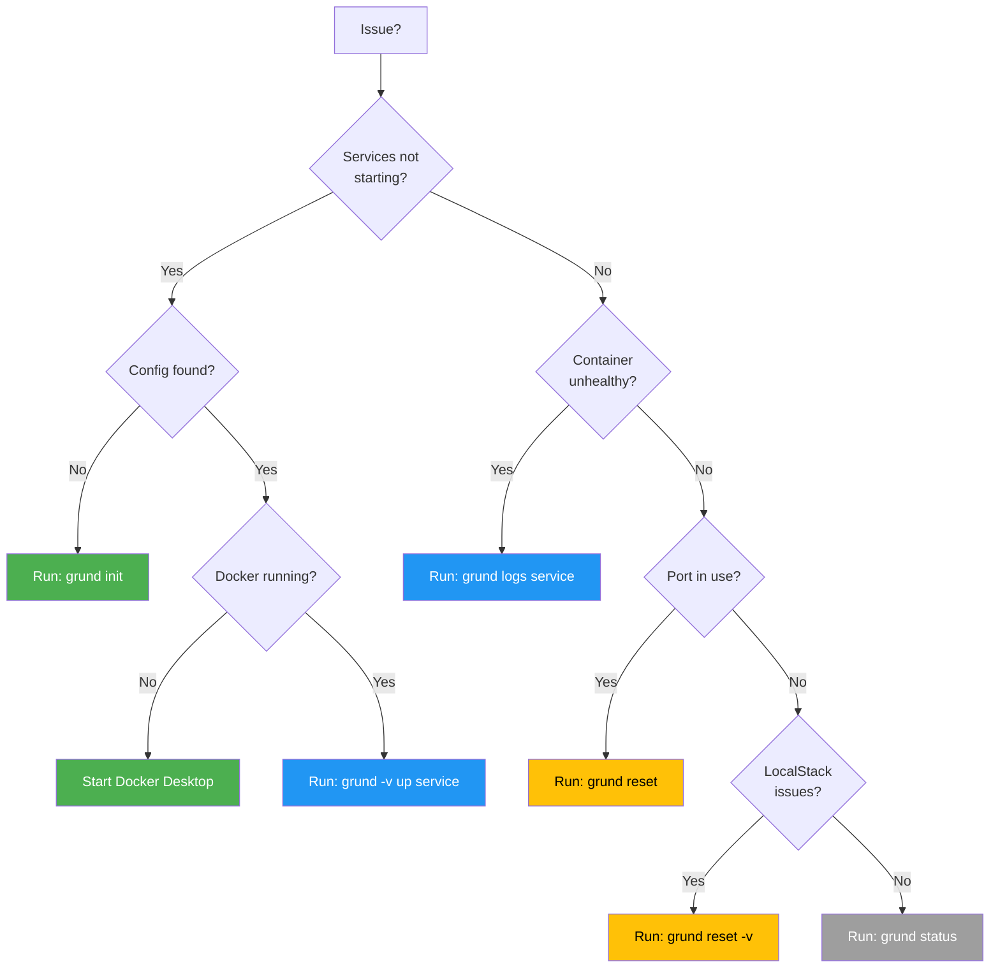
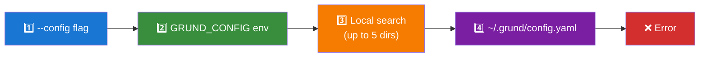

# Grund - Local Development Orchestration Tool

[](https://go.dev/)
[](LICENSE)
[](https://goreportcard.com/report/github.com/vivekkundariya/grund)
[](https://github.com/vivekkundariya/grund/releases)
[](https://buymeacoffee.com/vivekkundariya)

**Grund** is a CLI tool that enables developers to selectively spin up microservices and their dependencies with a single command. Declare dependencies in your service repos, and Grund resolves the full dependency tree, provisions infrastructure (databases, queues, caches), and starts everything in the correct order.


## Table of Contents

- [Why Grund?](#why-grund)
- [Prerequisites](#prerequisites)
- [Installation](#installation)
- [Getting Started](#getting-started)
- [Integration Guide](#integration-guide)
- [Commands Reference](#commands-reference)
- [Configuration Reference](#configuration-reference)
- [Shell Completion](#shell-completion)
- [Troubleshooting](#troubleshooting)

## Why Grund?

In a microservices architecture, running a single service locally often requires:
- Multiple dependent services
- Databases (PostgreSQL, MongoDB)
- Message queues (SQS, SNS)
- Object storage (S3)
- Cache (Redis)

Grund solves this by:
1. **Declarative dependencies** - Each service declares what it needs in a `grund.yaml`
2. **Automatic resolution** - Grund builds the full dependency tree
3. **Infrastructure provisioning** - Databases, queues, and buckets are created automatically
4. **Correct startup order** - Dependencies start before dependents

```bash
$ grund up payment-service

Starting infrastructure...
  ✓ postgres (localhost:5432)
  ✓ redis (localhost:6379)
  ✓ localstack (localhost:4566)
    → sqs: payment-queue ✓

Starting services...
  ✓ user-service (localhost:8081)
  ✓ payment-service (localhost:8080)

Ready!
```

## Prerequisites

- **Docker** and **Docker Compose** v2+
- **Go 1.21+** (for building from source)

## Installation

### Using Go Install

```bash
go install github.com/vivekkundariya/grund@latest
```

### From Source

```bash
git clone https://github.com/vivekkundariya/grund.git
cd grund
make install
```

### Verify Installation

```bash
grund --version
```

## Getting Started

### Quick Start (Recommended)

> [!TIP]
> Run `grund init` for an interactive setup wizard that handles all configuration automatically.

```bash
grund init
```


This walks you through:
1. **Global config** - Creates `~/.grund/config.yaml`
2. **Services setup** - Scans your projects folder and registers services
3. **AI assistant skills** - Installs skills for Claude Code and/or Cursor

### Manual Setup

#### Step 1: Initialize Global Configuration

```bash
grund config init
```

This creates `~/.grund/config.yaml` with default settings.

#### Step 2: Create Services Registry

Create a `services.yaml` file (or use `grund init` to auto-generate):

```yaml
version: "1"

services:
  user-service:
    repo: git@github.com:mycompany/user-service.git
    path: ~/projects/user-service

  payment-service:
    repo: git@github.com:mycompany/payment-service.git
    path: ~/projects/payment-service
```

#### Step 3: Initialize Services

In each service repository, create a `grund.yaml`:

```bash
cd ~/projects/user-service
grund service init
```

The interactive wizard will guide you through:
- Service name, type, and port
- Infrastructure requirements (PostgreSQL, Redis, etc.)
- Service dependencies


#### Step 4: Start Services

```bash
grund up user-service
```


## Integration Guide

### Adding Grund to an Existing Service

1. **Navigate to your service directory:**
   ```bash
   cd ~/projects/my-service
   ```

2. **Initialize Grund:**
   ```bash
   grund service init
   ```

3. **Or create `grund.yaml` manually:**
   ```yaml
   version: "1"

   service:
     name: my-service
     type: go  # go, python, or node
     port: 8080
     build:
       dockerfile: Dockerfile
       context: .
     health:
       endpoint: /health
       interval: 5s
       timeout: 3s
       retries: 10

   requires:
     services: []
     infrastructure: {}

   env:
     APP_ENV: development
     LOG_LEVEL: debug

   env_refs: {}
   ```

4. **Add infrastructure as needed:**
   ```bash
   grund service add postgres my_service_db
   grund service add redis
   grund service add queue events-queue
   ```

5. **Register in `~/.grund/config.yaml`:**

   > [!IMPORTANT]
   > Services must be registered before running `grund up`. The path must point to a directory containing `grund.yaml`.

   ```yaml
   services:
     my-service:
       repo: git@github.com:mycompany/my-service.git
       path: ~/projects/my-service
   ```

### Adding Dependencies Between Services

If `payment-service` depends on `user-service`:

```bash
cd ~/projects/payment-service
grund service add dependency user-service
```

This adds to `grund.yaml`:
```yaml
requires:
  services:
    - user-service

env_refs:
  USER_SERVICE_URL: "http://${user-service.host}:${user-service.port}"
```

### Infrastructure Options

#### PostgreSQL
```bash
grund service add postgres myapp_db
```

#### MongoDB
```bash
grund service add mongodb myapp_db
```

#### Redis
```bash
grund service add redis
```

#### SQS (via LocalStack)
```bash
grund service add queue order-events
```

#### SNS (via LocalStack)
```bash
grund service add topic notifications
```

#### S3 (via LocalStack)
```bash
grund service add bucket uploads
```

#### Tunnel (cloudflared or ngrok)
```bash
grund service add tunnel my-tunnel
```

> [!NOTE]
> Tunnels start **before** services, so `${tunnel.localstack.url}` is always available in your `env_refs`.

Expose local endpoints to the internet. Useful for:
- Making LocalStack S3 presigned URLs accessible to cloud LLMs
- Testing webhooks from external services
- Sharing local development servers

## Commands Reference

| Command | Description |
|---------|-------------|
| `grund up <service...>` | Start services and their dependencies |
| `grund down` | Stop all running services |
| `grund status` | Show running services and their status |
| `grund logs [service...]` | View service logs |
| `grund restart <service>` | Restart a specific service |
| `grund reset [-v]` | Stop services and optionally clean up volumes |
| `grund init` | Interactive setup wizard |
| `grund config show [service]` | Show configuration and settings |
| `grund service init` | Initialize `grund.yaml` in current directory |
| `grund service add <type>` | Add infrastructure to existing service |

> [!TIP]
> For detailed command documentation with examples and flags, see the [CLI Commands Reference](docs/wiki/cli-commands.md).

## Configuration Reference

### Service Configuration (`grund.yaml`)

<details>
<summary>📋 Click to expand full grund.yaml example</summary>

```yaml
version: "1"

service:
  name: my-service              # Service name (must match services.yaml)
  type: go                      # go, python, or node
  port: 8080                    # Port the service listens on
  build:
    dockerfile: Dockerfile      # Path to Dockerfile
    context: .                  # Build context
  health:
    endpoint: /health           # Health check endpoint
    interval: 5s                # Check interval
    timeout: 3s                 # Request timeout
    retries: 10                 # Retries before unhealthy

requires:
  services:                     # Service dependencies
    - user-service
    - auth-service
  infrastructure:
    postgres:
      database: my_db           # Database name
      migrations: ./migrations  # Optional: migrations path
    mongodb:
      database: my_mongo_db
    redis: true
    sqs:
      queues:
        - name: order-queue
          dlq: true             # Create dead-letter queue
        - name: notification-queue
    sns:
      topics:
        - name: order-events
    s3:
      buckets:
        - name: uploads
        - name: exports
    tunnel:
      provider: cloudflared     # or "ngrok"
      targets:
        - name: localstack
          host: "${localstack.host}"
          port: "${localstack.port}"

env:                            # Static environment variables
  APP_ENV: development
  LOG_LEVEL: debug

env_refs:                       # Dynamic environment variables
  DATABASE_URL: "postgres://postgres:postgres@${postgres.host}:${postgres.port}/${self.postgres.database}"
  REDIS_URL: "redis://${redis.host}:${redis.port}"
  USER_SERVICE_URL: "http://${user-service.host}:${user-service.port}"
  AWS_ENDPOINT: "http://${localstack.host}:${localstack.port}"
```

</details>

### Services Registry (`services.yaml`)

```yaml
version: "1"

services:
  user-service:
    repo: git@github.com:mycompany/user-service.git
    path: ~/projects/user-service

  payment-service:
    repo: git@github.com:mycompany/payment-service.git
    path: ~/projects/payment-service
```

### Global Configuration (`~/.grund/config.yaml`)

```yaml
version: "1"

services:
  user-service:
    path: ~/projects/user-service
    repo: git@github.com:mycompany/user-service.git

# Optional - uses defaults if not specified
docker:
  compose_command: docker compose    # default

localstack:
  endpoint: http://localhost:4566    # default
  region: us-east-1                  # default
```

### Environment Variable Interpolation

Use `${placeholder}` syntax in `env_refs` to reference infrastructure and services.

<details>
<summary>📋 Click to expand full placeholder reference</summary>

| Placeholder | Description |
|-------------|-------------|
| `${postgres.host}` | PostgreSQL hostname |
| `${postgres.port}` | PostgreSQL port (5432) |
| `${mongodb.host}` | MongoDB hostname |
| `${mongodb.port}` | MongoDB port (27017) |
| `${redis.host}` | Redis hostname |
| `${redis.port}` | Redis port (6379) |
| `${localstack.endpoint}` | LocalStack endpoint URL |
| `${localstack.host}` | LocalStack hostname |
| `${localstack.port}` | LocalStack port (4566) |
| `${localstack.region}` | AWS region (us-east-1) |
| `${localstack.account_id}` | AWS account ID (000000000000) |
| `${localstack.access_key_id}` | AWS access key ID |
| `${localstack.secret_access_key}` | AWS secret access key |
| `${sqs.<queue>.url}` | SQS queue URL |
| `${sqs.<queue>.arn}` | SQS queue ARN |
| `${sqs.<queue>.dlq}` | SQS dead-letter queue URL |
| `${sns.<topic>.arn}` | SNS topic ARN |
| `${s3.<bucket>.url}` | S3 bucket URL |
| `${<service>.host}` | Dependent service hostname |
| `${<service>.port}` | Dependent service port |
| `${self.postgres.database}` | This service's database name |
| `${tunnel.<name>.url}` | Public tunnel URL (https://...) |
| `${tunnel.<name>.host}` | Public tunnel hostname |

</details>

## Shell Completion

Enable tab completion for commands and service names.

### Zsh
```bash
# Add to ~/.zshrc
eval "$(grund completion zsh)"
```

### Bash
```bash
# Add to ~/.bashrc
eval "$(grund completion bash)"
```

### Fish
```bash
grund completion fish | source
```

After setup:
```bash
grund u<TAB>        → grund up
grund up pay<TAB>   → grund up payment-service
grund --<TAB>       → --config  --verbose  --help
```

## Troubleshooting

Use this decision tree to diagnose common issues:



---

### "services.yaml not found"

Grund searches for configuration in this order:



**Fix options:**

Set the `GRUND_CONFIG` environment variable:
```bash
export GRUND_CONFIG=/path/to/services.yaml
```

Or use the `--config` flag:
```bash
grund --config=/path/to/services.yaml up my-service
```

Or run the setup wizard:
```bash
grund init
```

### "Container is unhealthy"

Check container logs:
```bash
grund logs <service>
docker logs grund-<service>
```

### "Port already in use"

Stop existing services:
```bash
grund down
grund reset
```

Or check what's using the port:
```bash
lsof -i :8080
```

### "LocalStack resources not created"

Ensure LocalStack is healthy before provisioning:
```bash
grund status
```

If issues persist:
```bash
grund reset -v
grund up <service>
```

### View verbose output

Use `-v` flag for debug information:
```bash
grund -v up my-service
```

## License

MIT
