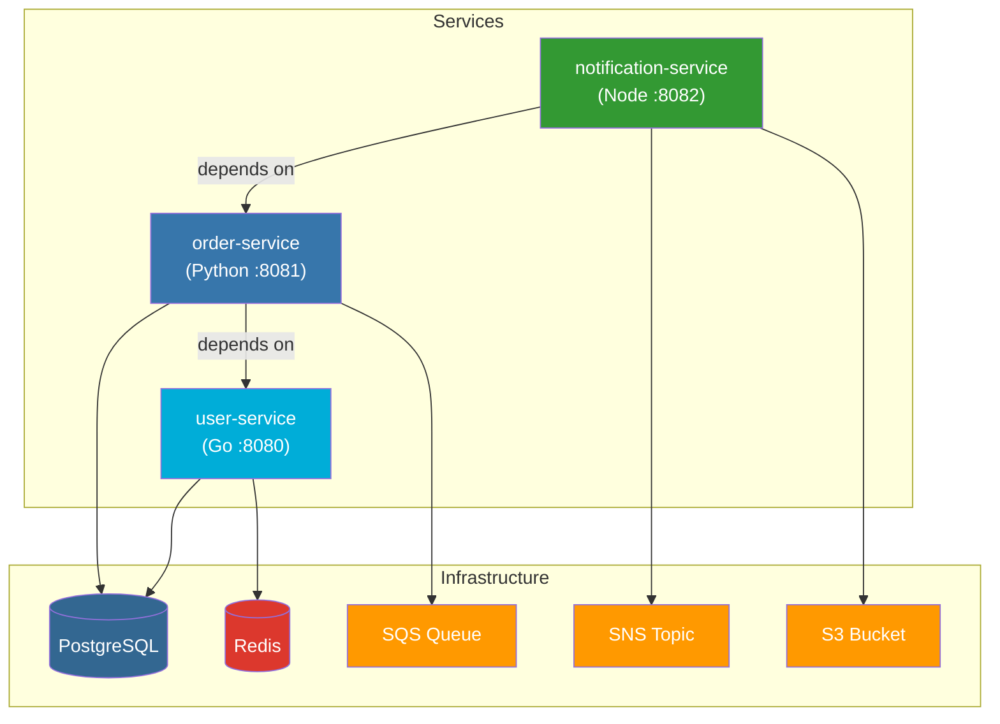

# Grund Demo Services

This directory contains example microservices demonstrating Grund's features.

## Architecture



## Services

### user-service (Go)
- **Port:** 8080
- **Infrastructure:** PostgreSQL, Redis
- **Endpoints:**
  - `GET /health` - Health check
  - `GET /users` - List all users
  - `POST /users` - Create user
  - `GET /users/{id}` - Get user by ID

### order-service (Python)
- **Port:** 8081
- **Infrastructure:** PostgreSQL, SQS
- **Dependencies:** user-service
- **Endpoints:**
  - `GET /health` - Health check
  - `GET /orders` - List all orders
  - `POST /orders` - Create order (validates user, publishes to SQS)
  - `GET /orders/{id}` - Get order by ID

### notification-service (Node.js)
- **Port:** 8082
- **Infrastructure:** SNS, S3
- **Dependencies:** order-service
- **Endpoints:**
  - `GET /health` - Health check
  - `POST /notify` - Send notification (publishes to SNS, logs to S3)
  - `GET /notifications` - List all notifications
  - `GET /notifications/{id}` - Get notification by ID
  - `GET /logs/{key}` - Get presigned URL for log file

## Quick Start

### 1. Register services

```bash
# From this directory
cd docs/demo
export GRUND_CONFIG=$(pwd)/services.yaml

# Or copy to global config
grund init
```

### 2. Start a single service

```bash
# Start user-service with its infrastructure (PostgreSQL, Redis)
grund up user-service
```

### 3. Start dependent services

```bash
# Start order-service (auto-starts user-service + PostgreSQL + Redis + LocalStack)
grund up order-service
```

### 4. Start all services

```bash
# Start notification-service (auto-starts entire stack)
grund up notification-service
```

## Example Usage

### Create a user
```bash
curl -X POST http://localhost:8080/users \
  -H "Content-Type: application/json" \
  -d '{"email": "alice@example.com", "name": "Alice"}'
```

### Create an order
```bash
curl -X POST http://localhost:8081/orders \
  -H "Content-Type: application/json" \
  -d '{"user_id": 1, "product": "Widget", "quantity": 5}'
```

### Send a notification
```bash
curl -X POST http://localhost:8082/notify \
  -H "Content-Type: application/json" \
  -d '{"user_id": 1, "message": "Your order has shipped!", "channel": "email"}'
```

### Check status
```bash
grund status
```

### View logs
```bash
grund logs -f
```

## Dependency Graph

When you run `grund up notification-service`, Grund:

1. **Resolves dependencies:**
   ```
   notification-service
   └── order-service
       └── user-service
   ```

2. **Aggregates infrastructure:**
   - PostgreSQL (for user-service + order-service)
   - Redis (for user-service)
   - LocalStack with:
     - SQS queue: `orders`
     - SNS topic: `notifications`
     - S3 bucket: `notification-logs`

3. **Starts in order:**
   1. Infrastructure (postgres, redis, localstack)
   2. Provisions resources (databases, queues, topics, buckets)
   3. user-service
   4. order-service
   5. notification-service

## Cleanup

```bash
# Stop all services
grund down

# Stop and remove data
grund reset -v
```

## Features Demonstrated

| Feature | Example |
|---------|---------|
| Multi-language | Go, Python, Node.js |
| Service dependencies | order-service → user-service |
| PostgreSQL | users_db, orders_db |
| Redis | User caching |
| SQS | Order events queue |
| SNS | Notification topic |
| S3 | Notification logs |
| Environment interpolation | `${postgres.host}`, `${sqs.orders.url}` |
| Health checks | `/health` endpoints |
