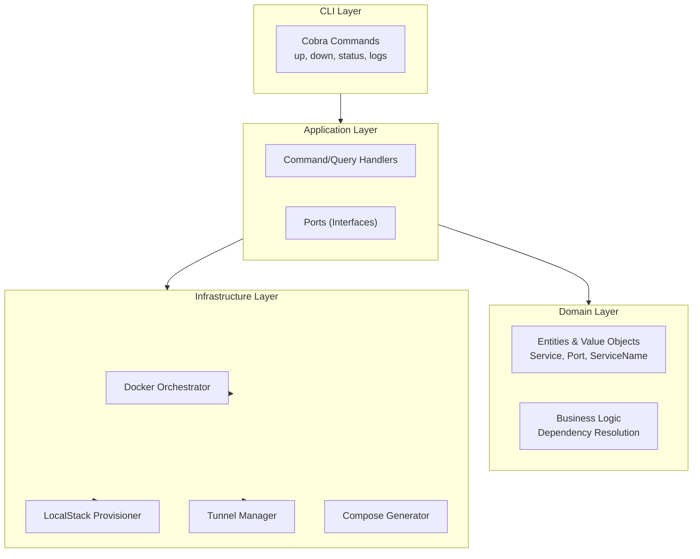
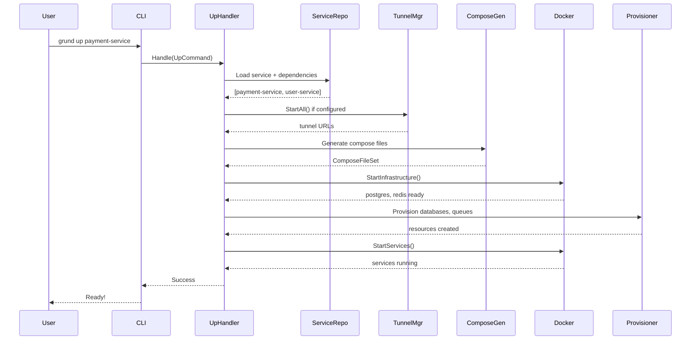
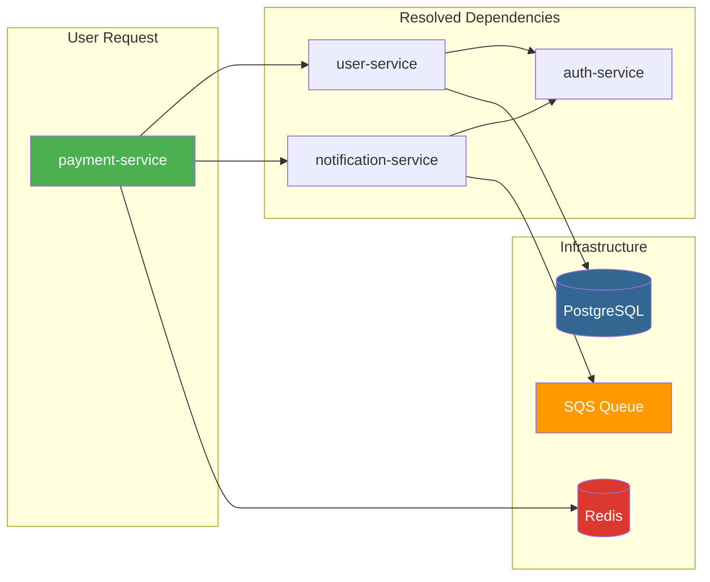
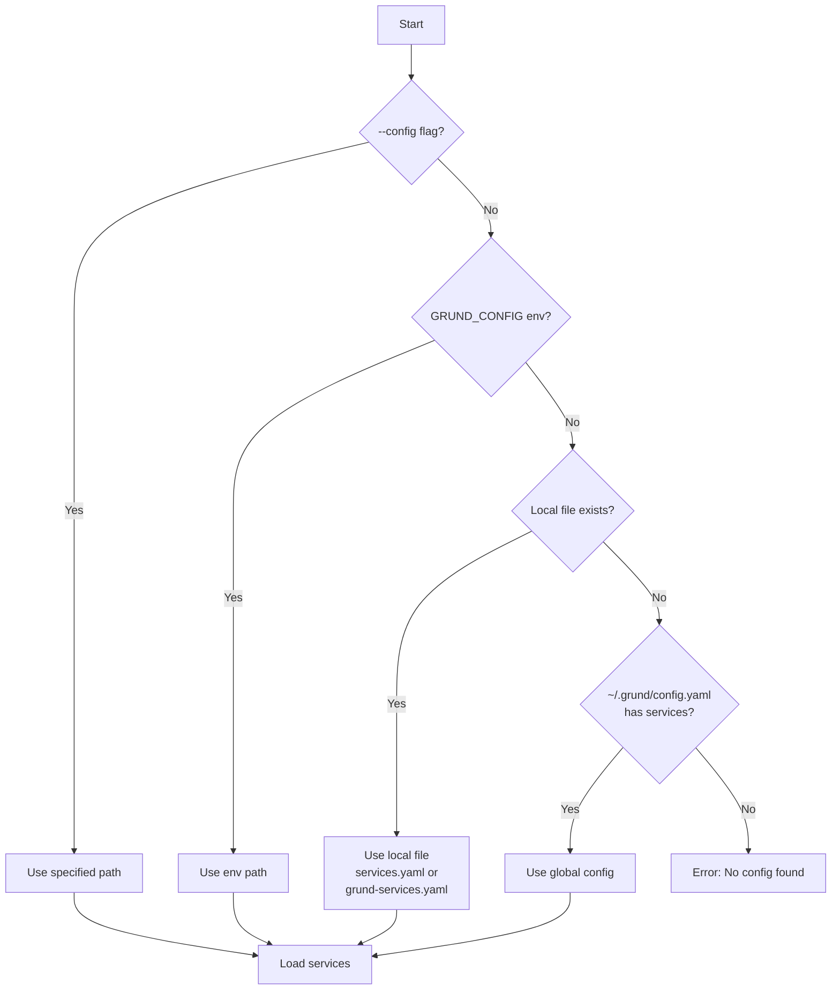
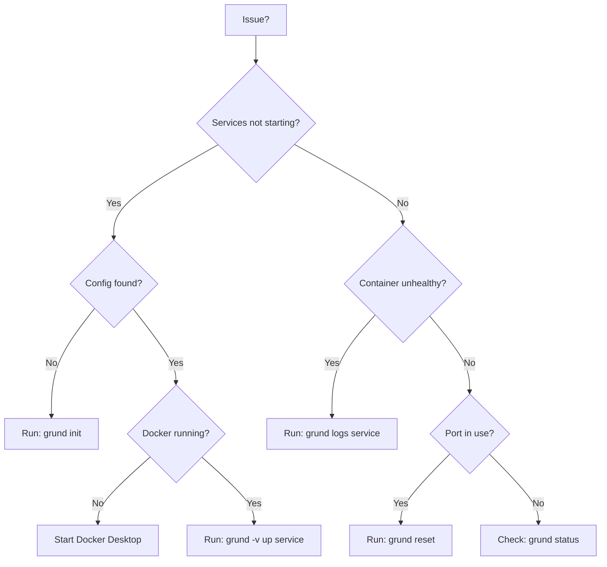

# Interactive Documentation Enhancement Plan

> **For Claude:** REQUIRED SUB-SKILL: Use superpowers:executing-plans to implement this plan task-by-task.

**Goal:** Transform Grund documentation from text-heavy to visual, interactive, and easy to consume.

**Architecture:** Layered approach - start with low-effort high-impact changes (Mermaid, alerts), then add rich media (GIFs, videos), finally create supporting assets (test services, screenshots).

**Tech Stack:** Mermaid.js (GitHub native), GitHub Markdown alerts, VHS/asciinema for terminal recordings, test microservices (Go/Python/Node)

---

## Phase 1: Mermaid Diagrams (Replace ASCII Art)

### Task 1.1: Architecture Overview Diagram

**Files:**
- Modify: `docs/wiki/architecture.md`

**Current:** ASCII box diagram showing layered architecture
**Replace with:** Mermaid flowchart



---

### Task 1.2: Data Flow Sequence Diagram

**Files:**
- Modify: `docs/wiki/architecture.md`

**Current:** ASCII step diagram for `grund up` flow
**Replace with:** Mermaid sequence diagram



---

### Task 1.3: Dependency Resolution Diagram

**Files:**
- Modify: `docs/wiki/algorithms.md`

**Add:** Visual representation of dependency graph resolution



---

### Task 1.4: Configuration Resolution Flowchart

**Files:**
- Modify: `docs/wiki/configuration.md` or `README.md`

**Add:** Decision tree for config resolution



---

### Task 1.5: Troubleshooting Decision Tree

**Files:**
- Modify: `README.md` (Troubleshooting section)

**Add:** Interactive troubleshooting guide



---

## Phase 2: GitHub Alerts & Callouts

### Task 2.1: Add Alerts to README

**Files:**
- Modify: `README.md`

**Add alerts for:**

```markdown
> [!TIP]
> Run `grund init` for an interactive setup wizard that handles all configuration.

> [!WARNING]
> Using `grund reset -v` will delete all database data. Make sure to backup important data first.

> [!NOTE]
> Tunnels start automatically before services, so `${tunnel.localstack.url}` is always available in env_refs.

> [!IMPORTANT]
> Services must be registered in `~/.grund/config.yaml` before running `grund up`.
```

---

### Task 2.2: Add Alerts to CLI Commands Doc

**Files:**
- Modify: `docs/wiki/cli-commands.md`

**Add contextual alerts for each command.**

---

## Phase 3: Collapsible Sections

### Task 3.1: Collapse Advanced Config Examples

**Files:**
- Modify: `README.md`

**Wrap detailed YAML examples in collapsible sections:**

```markdown
<details>
<summary>📋 Full grund.yaml example with all options</summary>

```yaml
version: "1"
# ... full config
```

</details>
```

---

### Task 3.2: Collapse Troubleshooting Details

**Files:**
- Modify: `README.md`

**Make troubleshooting expandable to keep page clean.**

---

## Phase 4: Terminal Recordings (GIFs)

### Task 4.1: Create Demo Services

**Requires from user:**
- [ ] Decision: Use existing demo services or create new ones?
- [ ] Preference for service languages (Go/Python/Node mix?)

**Create minimal test services:**

```
demo/
├── user-service/           # Go service
│   ├── main.go
│   ├── Dockerfile
│   └── grund.yaml
├── order-service/          # Python service
│   ├── app.py
│   ├── Dockerfile
│   └── grund.yaml
└── notification-service/   # Node service
    ├── index.js
    ├── Dockerfile
    └── grund.yaml
```

**Dependencies:**
- `order-service` → `user-service`
- `notification-service` → `order-service`
- `user-service` → PostgreSQL, Redis
- `order-service` → PostgreSQL, SQS
- `notification-service` → SNS, S3

---

### Task 4.2: Record `grund init` Walkthrough

**Tool:** VHS (https://github.com/charmbracelet/vhs)

**Script:** `docs/assets/recordings/init.tape`

```tape
Output docs/assets/recordings/grund-init.gif

Set FontSize 14
Set Width 1200
Set Height 600
Set Theme "Dracula"

Type "grund init"
Enter
Sleep 2s

# ... interact with wizard
```

**Requires from user:**
- [ ] Clean ~/.grund directory for fresh recording
- [ ] Test projects folder path

---

### Task 4.3: Record `grund up` with Dependencies

**Script:** `docs/assets/recordings/up.tape`

Show:
1. Running `grund up order-service`
2. Dependencies being resolved
3. Infrastructure starting (postgres, redis, localstack)
4. Resources being provisioned
5. Services starting in order
6. Final "Ready!" message

---

### Task 4.4: Record `grund status` Output

**Script:** `docs/assets/recordings/status.tape`

Show colored status table with running/stopped services.

---

## Phase 5: Quick Reference & Cheatsheets

### Task 5.1: Create Command Cheatsheet

**Files:**
- Create: `docs/wiki/cheatsheet.md`

**Content:**

| Task | Command |
|------|---------|
| Start service | `grund up <service>` |
| Start without deps | `grund up <service> --no-deps` |
| Start infra only | `grund up <service> --infra-only` |
| Stop all | `grund down` |
| View logs | `grund logs <service> -f` |
| Check status | `grund status` |
| Fresh start | `grund reset -v` |
| Add postgres | `grund service add postgres mydb` |
| Add queue | `grund service add queue my-queue` |

---

### Task 5.2: Create Placeholder Reference Card

**Files:**
- Create: `docs/wiki/placeholders.md`

**Visual reference for all `${...}` placeholders with examples.**

---

## Phase 6: Comparison & Use Case Content

### Task 6.1: Before/After Comparison

**Files:**
- Modify: `README.md`

**Add visual comparison:**

| Without Grund | With Grund |
|---------------|------------|
| `docker-compose up -d postgres`<br/>`docker-compose up -d redis`<br/>`docker-compose up -d localstack`<br/>`aws --endpoint-url=... sqs create-queue`<br/>`docker-compose up -d user-service`<br/>`docker-compose up -d payment-service` | `grund up payment-service` |

---

### Task 6.2: Real-World Use Case Examples

**Files:**
- Create: `docs/wiki/examples.md`

**Scenarios:**
1. "I want to work on the payment service"
2. "I need to test SQS integration locally"
3. "I want to expose LocalStack to an external LLM"
4. "I'm onboarding a new developer"

---

## Deliverables Summary

### Files to Create:
- [ ] `docs/assets/recordings/grund-init.gif`
- [ ] `docs/assets/recordings/grund-up.gif`
- [ ] `docs/assets/recordings/grund-status.gif`
- [ ] `docs/wiki/cheatsheet.md`
- [ ] `docs/wiki/placeholders.md`
- [ ] `docs/wiki/examples.md`
- [ ] `demo/user-service/` (test service)
- [ ] `demo/order-service/` (test service)
- [ ] `demo/notification-service/` (test service)

### Files to Modify:
- [ ] `README.md` (alerts, collapsibles, comparison, GIFs)
- [ ] `docs/wiki/architecture.md` (Mermaid diagrams)
- [ ] `docs/wiki/algorithms.md` (dependency graph visual)
- [ ] `docs/wiki/cli-commands.md` (alerts, examples)
- [ ] `docs/wiki/configuration.md` (flowchart)

---

## What I Need From You

### For Demo Services:
1. **Service preference:** Should demo services be:
   - Minimal (just `/health` endpoint)?
   - Realistic (actual CRUD operations)?

2. **Language mix:** Suggested Go + Python + Node to show polyglot support. OK?

3. **Location:** Create in `demo/` folder in repo, or separate repo?

### For Terminal Recordings:
1. **Recording tool preference:**
   - VHS (Charm) - scriptable, reproducible
   - asciinema - simple, web playback
   - terminalizer - GIF output

2. **Clean environment:** Need fresh `~/.grund/` for authentic first-run experience

3. **Terminal theme:** Preference for light/dark? Specific theme?

### For Screenshots:
1. **Terminal app:** Which terminal do you use? (for consistent screenshots)

2. **Color scheme:** Match your usual setup or use a standard theme?

---

## Execution Order

Recommended order for maximum impact with minimum dependencies:

```
Phase 1 (Mermaid) → Can do immediately, no external deps
     ↓
Phase 2 (Alerts) → Can do immediately
     ↓
Phase 3 (Collapsibles) → Can do immediately
     ↓
Phase 4 (Recordings) → Needs demo services + your input
     ↓
Phase 5 (Cheatsheets) → Can do immediately
     ↓
Phase 6 (Use Cases) → Can do after demo services exist
```

**Phases 1-3, 5 can be done in parallel without your input.**
**Phases 4, 6 need the decisions above.**
